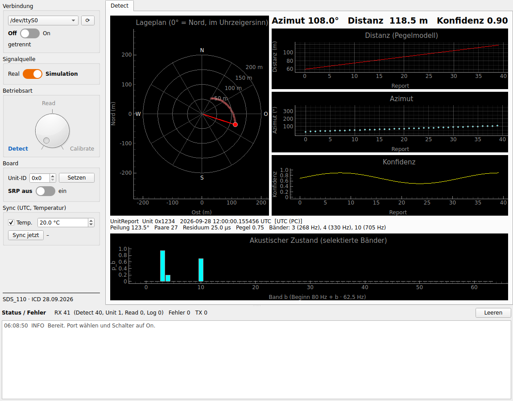
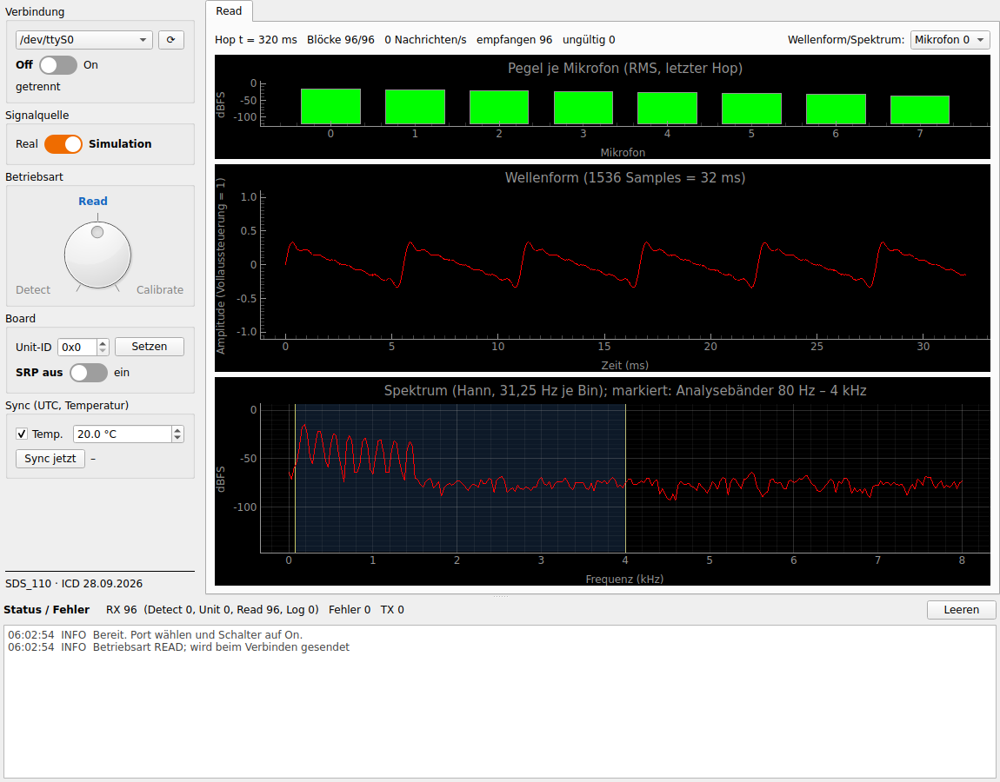
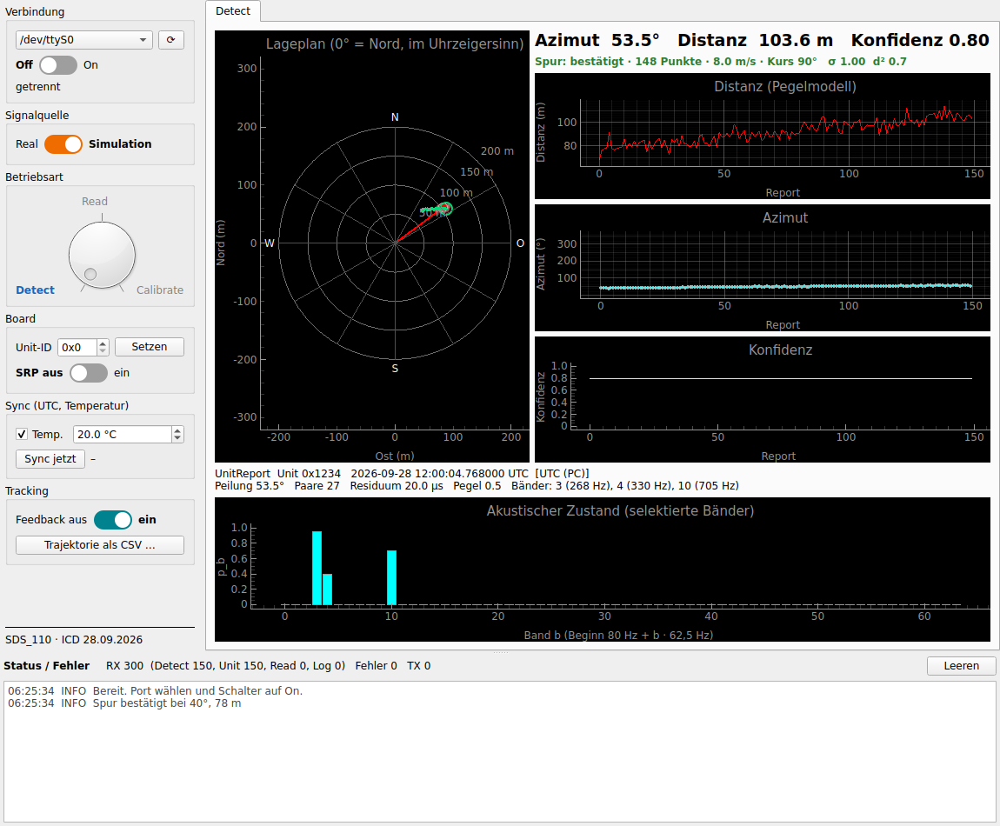
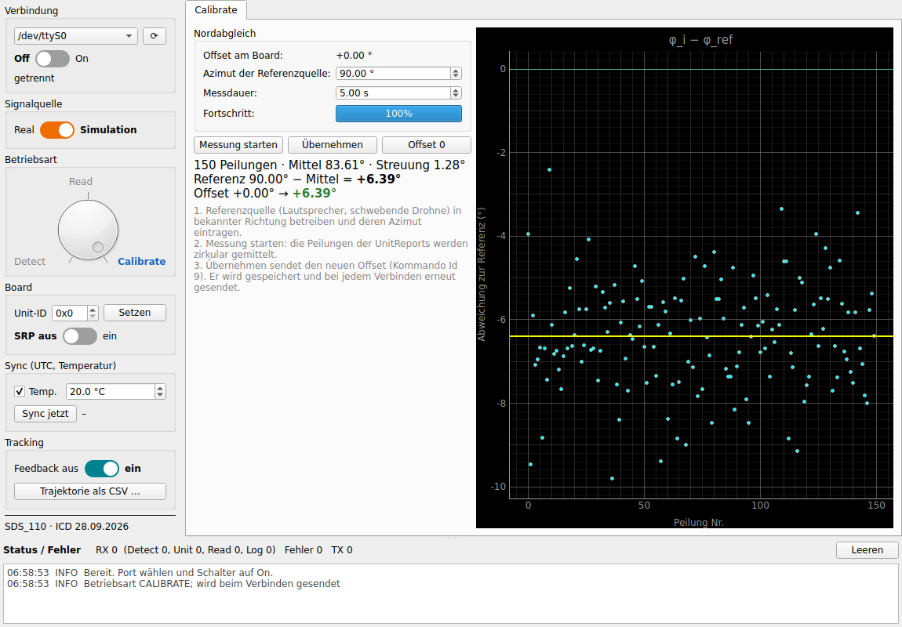
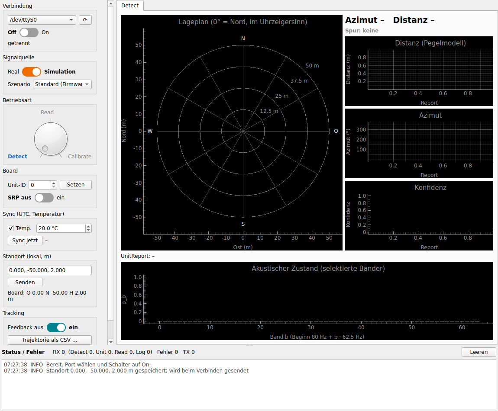

# PC-Monitor – Analyse und ToDo-Liste

- **Stand:** 28.09.2026.
- **Analysiert:** Stand `main` 7d1b7de („07-09-1“).
- **Bezüge:**
  - Schnittstelle: SDS_110 `doc/ICD_SDS_PC_Monitor.md`
  - Patent: FSL9 (SDS_110 `doc/Stefan_FSL9.docx`)
  - Traceability der Firmware: SDS_110 `doc/Traceability_FSL9.md`
- **Umgesetzt:** GUI-Redesign (Abschnitt 3) sowie die Befunde P1, P2, P11 (Log-Flut) und P13–P15. Seit 28.09.2026 außerdem T1–T6 und T8–T11 (Abschnitte 3a–3f). Offen ist T7 (mehrere Einheiten). Die übrigen Befunde sind offen und in der ToDo-Liste (Abschnitt 4) eingeplant.

## 1. Aufbau

| Teil | Dateien | Aufgabe |
| --- | --- | --- |
| Start | `app/main.py` | QApplication, MainWindow |
| Hauptfenster | `app/gui/main_window.py` | Layout, USB-Verbindung, Queue-Polling mit 50 Hz |
| Modell | `app/model/SDSUSBModel.py` | Queues, Zähler, Aufbau der Kommandos PC → SDS |
| USB | `app/usb/usb_reader.py`, `usb_writer.py`, `sds_parser.py`, `messages.py` | QThreads: Frames lesen (Resync, CRC) und in Queues legen, Kommandos schreiben; Nachrichten zerlegen |
| Tabs | `app/tabs/tab_detect.py`, `tab_read.py`, `tab_calibrate.py` | Anzeige je Betriebsart |
| Bedienelemente | `app/widgets/control_panel.py`, `mode_dial.py`, `toggle_switch.py`, `status_panel.py` | Bedienfeld links, Status unten |
| Tracking | `app/tracking/tracker.py`, `feedback.py` | Tracking-Einheit 150, Feedback Id 8 |
| Kalibrierung | `app/calibration.py` | Nordabgleich (Id 9) |
| Werkzeuge | `tools/hw_reader.py`, `hw_writer.py` | Hilfsskripte für einen echten Port, nicht Teil der Tests |

Der Altbestand (`Safe/`, `srp_monitor.py`, `app/gui/sds_read_usb_receiver_gui.py`, `app/usb/usb_port_manager.py`) ist seit T9 entfernt; er steht in der Git-Historie.

Datenfluss: Der `USBReader` gibt den Bytestrom an den `SDSParser` (Resync auf das Magic, Länge je Id, CRC) und legt die Frames nach Id in `detect_queue`, `read_queue`, `unit_queue`, `log_queue` oder `inspect_queue` (Fehler). Das Hauptfenster leert die Queues alle 20 ms mit einem Zeitbudget von 15 ms und verteilt die Frames an die Tabs und die Tracking-Einheit.

## 2. Befunde

Status: **behoben** = in diesem Stand umgesetzt und getestet, **offen** = in der ToDo-Liste eingeplant.

| Nr. | Prio | Befund | Folge | Status |
| --- | --- | --- | --- | --- |
| P1 | hoch | `SDSMode` hatte READ = 2 und CALIBRATE = 3; die Firmware erwartet CALIBRATE = 2 und READ = 3 | Der Drehschalter auf READ hat CALIBRATE geschickt und umgekehrt. Das ist die Ursache von SDS_110 Befund 25. | behoben (`SDSUSBModel.py`) |
| P2 | hoch | Die CRC der Kommandos war fest `12 34 56 78` | Sobald die Firmware die CRC prüft (SDS_110 Befund 12), würde sie jedes Kommando verwerfen | behoben: CRC32 wie zlib, big-endian (ICD 3) |
| P3 | hoch | Findet der Reader das Magic nicht, verwirft er 8 Byte und liest den nächsten Kopf | Ist der Datenstrom um k Byte versetzt, bleibt er versetzt, und alle folgenden Frames gehen verloren. Der vorhandene `SDSParser` synchronisiert Byte für Byte, wird aber nicht benutzt. | behoben (T1) |
| P4 | hoch | Empfangene Frames werden ohne CRC-Prüfung angenommen | Gestörte Frames werden angezeigt | behoben (T1) |
| P5 | hoch | Die Länge aus `len_id` wird nicht geprüft | Bei einer Länge < 8 wird mit negativer Länge gelesen; bei großen Werten blockiert das Lesen bzw. es werden Frames verschluckt | behoben (T1) |
| P6 | hoch | UnitReport (Id 5) und Logger (Id 99) sind unbekannt und werden als Fehler gezählt | µs-Zeit, Zeitquelle, Paare, Residuum, Bänder und p_b sowie die Meldungen der Firmware werden nicht angezeigt | behoben (T2) |
| P7 | hoch | Es fehlen die Kommandos Sync (Id 7: UTC und Temperatur), Unit-ID (5) und SRP-Referenz (6). Id 1 sendet immer 0. | kein UTC-Bezug, Schallgeschwindigkeit bleibt 343 m/s (FSL9 A23), keine Einheiten-Kennung | behoben (Id 3 mit dem Redesign, Id 5, 6, 7 mit T3) |
| P8 | mittel | Der Detect-Tab zeichnet x = d·sin φ, y = d·cos φ, also φ ab Nord im Uhrzeigersinn; die Firmware sendet φ ab der x-Achse gegen den Uhrzeigersinn | Das Ziel erscheint gespiegelt und gedreht (Firmware 90° wird rechts statt oben gezeichnet) | behoben (T5): Konvention 0° = Nord, im Uhrzeigersinn, Mikrofon 0 = Nord in Firmware (SDS_110 Befund 41) und PC |
| P9 | mittel | Die Achsen im Detect-Tab sind fest (±100 m, 0–200 m); die Unit-ID wird ignoriert; es gibt keine Spur und keinen Verlauf | Ziele außerhalb von 100 m fallen aus dem Bild, mehrere Einheiten sind nicht unterscheidbar | Achsen und Verlauf behoben (T5); mehrere Einheiten offen (T7) |
| P10 | hoch | Der Read-Tab teilt die 128 Werte in 8 Mikrofone × 16 auf. Tatsächlich enthält jede Nachricht 128 Samples **eines** Mikrofons (`micNr`) für Block `frameNr` 0…11. Die Werte werden als uint32 statt int32 gelesen. | Pegel und Werte sind falsch, negative Samples erscheinen als ~4·10⁹, der Hop wird nicht zusammengesetzt | behoben (T4, 28.09.2026) |
| P11 | hoch | Bei READ kommen ~3000 Nachrichten/s. Der Reader meldete jedes Frame als Hex-Text, der Inspector baute bei jedem Frame seinen Text neu auf, und der Read-Tab setzt bei jedem Frame seinen Text | Die GUI friert ein, der Speicher wächst (Queues ohne Grenze) | behoben: Log-Flut, Read-Tab zeichnet mit 10 Hz, Zeitbudget je Poll, begrenzte Queues (T4) |
| P12 | mittel | `serial.read()` mit 0,1 s Timeout kann den Rest eines Frames nur teilweise liefern | Meldung „payload_incomplete“ und danach Versatz (P3) | behoben (T1: Bytestrom statt fester Lesegrößen) |
| P13 | niedrig | Der Inspector zählte unbekannte Ids als „corrupt“. Der Logger schrieb in dasselbe Textfeld, das der Inspector 50-mal pro Sekunde geleert hat. Die TX-Statistik kannte nur die Ids 1–3. | falsche Zähler, Meldungen verschwanden sofort | behoben (Status-Fenster, `update_sent` für alle Ids) |
| P14 | niedrig | Altbestand im Repository: `Safe/`, `srp_monitor.py` (tkinter, 24-Byte-Frames), `sds_read_usb_receiver_gui.py` (defekter Import), unbenutzte Teile (`STOP_REQUESTED`, `USBPortManager`) | Verwechslungsgefahr beim Weiterentwickeln | behoben (T9) |
| P15 | niedrig | 25 `__pycache__`-Dateien im Repository, keine `requirements.txt`, Tests nur als Skripte gegen COM5 | Build nicht reproduzierbar, keine automatischen Tests | behoben: `.gitignore`, `requirements.txt`, Tests ohne Hardware |
| P16 | mittel | Wird USB getrennt, fängt der Reader die Ausnahme und versucht es endlos erneut; die GUI erfährt davon nichts | Die Anzeige bleibt „verbunden“ | behoben (T6) |
| P17 | hoch | Die PC-Seite des Patents fehlt: Inter-Unit-Korrelation und Lokalisation (Teile von 126, 128), Candidate Report (130), Tracking-Einheit (150) und Feedback (Id 8) | FSL9 §6–10 und die Ansprüche 6–12 sind nicht umgesetzt (`Traceability_FSL9_PC.md`) | offen (T7, T8) |
| P18 | niedrig | Die Firmware hat in CALIBRATE keine Funktion | Der Calibrate-Tab bleibt ohne Daten | behoben (T10): CALIBRATE verarbeitet wie DETECT, Tab Nordabgleich |
| P19 | mittel | Es kann nur ein COM-Port bzw. eine Einheit verbunden werden | FSL9 verlangt N ≥ 2 Einheiten | offen (T7) |
| P20 | hoch | Am Board fror die App beim Umschalten auf Read ein. `process_queue` leerte die Read-Queue ohne Zeitgrenze, und der Read-Tab baute je Nachricht Text neu auf. Bei ~3000 Nachrichten/s kam die GUI nicht mehr in die Ereignisschleife zurück. Außerdem beendet PyQt6 das Programm bei jeder nicht abgefangenen Ausnahme in einem Slot. | App friert ein bzw. bricht ab (Rückmeldung vom 28.09.2026) | behoben: Zeitbudget 15 ms je Poll, Read-Tab neu, begrenzte Queues, Schutz vor Meldungsfluten, `sys.excepthook` meldet Fehler im Status-Fenster statt abzubrechen. Test `test_read_load.py`; derselbe Test hängt mit dem alten Stand. |

## 3. Umgesetzt: GUI-Redesign

- **Links:** ein Bedienfeld mit fester Breite, das alle Schalter enthält.
  - COM-Port mit Aktualisieren-Knopf.
  - Schalter **Off/On** öffnet und schließt die Verbindung. Schlägt das Öffnen fehl, springt der Schalter zurück auf Off.
  - Schalter **Real/Simulation** sendet ICD Id 3. Die Grundstellung ist Simulation wie in der Firmware.
  - Drehschalter **Detect – Read – Calibrate** (links, oben, rechts) sendet ICD Id 2.
- **Oben rechts:** die Tabs Detect, Read und Calibrate, links ausgerichtet. Sichtbar ist nur der Tab, den der Drehschalter wählt.
- **Unten:** das Status-/Fehlerfenster mit Zählerzeile (RX, Fehler, TX) und Meldungen mit Zeit und Stufe (INFO, WARN, ERROR, TX). Die Höhe lässt sich per Splitter ändern. Das Fenster ersetzt den Inspector-Tab.
- **Beim Verbinden** sendet der Monitor den Stand beider Schalter an das Board, sodass Board und GUI übereinstimmen. Ändert man die Schalter ohne Verbindung, werden sie beim nächsten Verbinden gesendet.

Tests ohne Hardware (`python -m pytest tests/test_protocol.py tests/test_gui.py tests/test_loopback.py`, 13 Tests):
- Kommando-Bytes und CRC nach ICD.
- Der Drehschalter wählt den Tab und sendet die Betriebsart.
- Schalter Simulation/Real.
- On ohne Port meldet einen Fehler.
- Fehler erscheinen im Status-Fenster.
- Verbindung über einen virtuellen seriellen Port (pty): On sendet Simulation und Mode, und ein Detect-Frame erreicht die Anzeige.

## 3a. Umgesetzt: T1–T3 (28.09.2026)

- **T1, Empfang:**
  - Der `USBReader` liest die verfügbaren Bytes und zerlegt sie mit `SDSParser`.
  - Der Parser synchronisiert Byte für Byte auf das Magic und prüft die Länge je Id: Detect 32, Read 532, UnitReport und Logger 144, unbekannte Ids 12–1024 Byte.
  - Er prüft die CRC32. Bei einem Fehler verwirft er nur 1 Byte, damit ein scheinbares Magic in den Nutzdaten keine echten Frames kostet.
  - Ein Resync erscheint als Warnung im Status-Fenster, Längen- und CRC-Fehler als Fehler.
- **T2, UnitReport (Id 5):**
  - Neu ist das Modul `app/usb/messages.py`.
  - Der Detect-Tab zeigt Unit-ID, Zeit (UTC mit µs oder Laufzeit) und Zeitquelle, Peilung, Paare, Residuum, Pegel und die Bänder mit Frequenz.
  - Dazu kommt ein Balkendiagramm des akustischen Zustands p_b über 64 Bänder.
- **T2, Logger (Id 99):** Die Meldungen erscheinen als Zeilen „SDS: …“ im Status-Fenster. Über mehrere Pakete geteilte Zeilen werden wieder zusammengesetzt.
- **T3, Kommandos:**
  - Das Bedienfeld hat die neuen Gruppen **Board** (Unit-ID setzen, Id 5; Schalter SRP aus/ein, Id 6) und **Sync** (Temperatur −40…+60 °C oder „aus“ = unbekannt, Knopf „Sync jetzt“).
  - Sync (Id 7) mit UTC in µs und Temperatur wird gesendet beim Verbinden, jede Minute, bei Änderung der Temperatur und per Knopf.
  - Beim Verbinden werden Signalquelle, Betriebsart, SRP und Sync gesendet.
- **Tests (31, ohne Hardware):**
  - Parser: Resync bei jedem Versatz 1–8, byteweise Zufuhr, CRC-Fehler, falsche Länge, Magic in den Nutzdaten.
  - UnitReport gegen Bytes, die mit dem Firmware-Code `Output_Interface_130` erzeugt wurden.
  - Sync-Bytes gleich dem Beispiel der ICD.
  - GUI-Bedienelemente.
  - Loopback über pty: Kommandos beim Verbinden; Detect, UnitReport und Logger nach Störbytes.

## 3b. Umgesetzt: Absturz im Modus READ und Read-Tab (T4, 28.09.2026)

- **Read-Tab neu:**
  - Die Samples je Mikrofon und Block werden als int32 in einen Hop-Puffer (8 × 1536) übernommen.
  - Er zeigt den Pegel je Mikrofon (RMS in dBFS) und die Wellenform (ein Mikrofon oder alle).
  - Dazu kommen die Blöcke je Hop, Nachrichten/s und die Zahl ungültiger Nachrichten.
  - Er zeichnet höchstens 10-mal pro Sekunde und nur, wenn er sichtbar ist.
- **Hauptfenster:**
  - `process_queue` arbeitet höchstens 15 ms je Poll.
  - Die Queues sind begrenzt (20 000 Einträge). Verworfene Nachrichten werden gezählt und gemeldet.
  - Mehr als 20 Meldungen pro Sekunde fasst das Status-Fenster zusammen.
- **`app/main.py`:** Nicht abgefangene Ausnahmen beenden das Programm nicht mehr, sondern erscheinen im Status-Fenster und auf der Konsole.
- **Lasttest `test_read_load.py`:**
  - Ablauf: 96 Nachrichten je 32 ms für 2 s, während die Ereignisschleife läuft.
  - Ergebnis: Alle 6048 Nachrichten kommen an, ein Poll dauert höchstens 1,2 ms, die Ereignisschleife pausiert höchstens 32 ms, und die Pegel stimmen auf 0,1 dB.
  - Gegenprobe: Mit dem alten Stand hängt derselbe Test.
- **Spektrum (ergänzt):**
  - Hann-Fenster über den Hop (1536 Punkte, 31,25 Hz je Bin), Anzeige 0–8 kHz in dBFS.
  - Normiert so, dass ein Sinus mit Amplitude A als 20·log10(A) erscheint.
  - Markiert ist der Bereich der Analysebänder 80 Hz – 4 kHz.
  - Test: Spitze auf der richtigen Frequenz und mit dem richtigen Pegel (± 0,1 dB) für 8 Mikrofone.

## 3c. Umgesetzt: Azimut und Lageplan (T5, 28.09.2026)

- **Festlegung:** 0° = Nord, im Uhrzeigersinn, Mikrofon 0 zeigt nach Nord. Umgesetzt ist das in der Firmware (SDS_110 `Azimuth.hpp`, Befund 41) und hier.
- **Lageplan:**
  - Nord oben, Ost rechts (x = r · sin φ, y = r · cos φ).
  - Ringe mit Beschriftung, Strahlen alle 30° und Himmelsrichtungen N/O/S/W.
  - Der Radius passt sich an die größte Distanz im Verlauf an (25 m … 5 km).
  - Die Spur zeigt die letzten 60 Positionen.
- **Verläufe:** Distanz (automatische Skala), Azimut und Konfidenz über die letzten 200 Reports; groß angezeigt werden Azimut, Distanz und Konfidenz des letzten Reports.
- **Tests:** `test_detect.py` prüft die Umrechnung für N/O/S/W/NO, die Wahl des Radius und den Punkt im Osten bei 90°.

## 3d. Umgesetzt: USB-Abbruch (T6, 28.09.2026)

- **Reader:** Eine `SerialException` oder `OSError` beim Lesen (Kabel gezogen, Board zurückgesetzt) meldet `connection_lost` genau einmal, danach endet der Thread. Andere Lesefehler zählen; nach 20 in Folge gilt die Verbindung ebenfalls als verloren.
- **Writer:** Schreibfehler der Schnittstelle melden `connection_lost`.
- **Hauptfenster:**
  - Es trennt sauber: Threads beendet, Port geschlossen, Sync-Timer gestoppt.
  - Der Schalter springt auf Off, und „Verbindung verloren“ steht im Bedienfeld.
  - Im Status-Fenster steht die Fehlermeldung mit Port und Grund.
  - Die Portliste wird neu eingelesen, sodass man nach dem Wiedereinstecken mit On neu verbinden kann.
- **Absichtliches Trennen** (Schalter Off, Fenster schließen) meldet keinen Abbruch.
- **Tests (`test_connection_lost.py`):**
  - Reader und Writer mit einer Schnittstelle, die wie ein gezogenes Kabel Fehler wirft.
  - Absichtliches Trennen.
  - Abbruch am virtuellen Port: Die Gegenseite wird geschlossen, der Schalter geht auf Off.
- **Nebenbei:** Die Tests teilen sich jetzt eine `QApplication` (`tests/conftest.py`); eine zwischendurch freigegebene `QApplication` ließ spätere Tests abstürzen.

## 3e. Umgesetzt: Tracking-Einheit (T8, 28.09.2026)

- **Modul `app/tracking/tracker.py`** (ohne Qt, Komponente B, FSL9 §8–9):
  - Candidate Reports mit φ, r, t und s (p_b über 64 Bänder).
  - Referenzzustand ŝ mit α = 0,2.
  - Kalman-Filter mit konstanter Geschwindigkeit in (Ost, Nord).
  - Gate: Kosinus > 0,7 und Mahalanobis² < 9,21.
  - Übernahme nur bei beiden Kriterien.
  - Spur bestätigt nach 3 aufeinanderfolgenden Reports, Ende nach 2 s ohne Übernahme.
- **Candidate Report aus einer Einheit:** φ, t und s kommen aus dem UnitReport (Id 5), r aus dem Detect-Frame (Id 1, Pegelmodell) mit demselben ms-Zeitstempel.
- **Annahmen** (als Konstanten einstellbar):
  - σ_φ = 3° und σ_r = 30 % (mindestens 5 m); das Pegelmodell ist grob.
  - Beschleunigungsrauschen 3 m/s².
  - Anfangsunsicherheit der Geschwindigkeit 15 m/s.
- **Feedback `app/tracking/feedback.py`, Id 8 (§10):**
  - Nach jeder Übernahme in die bestätigte Spur werden ŝ und die Vorhersage für die nächsten 32 ms gesendet, bei Spurende ein Zurücksetzen.
  - Schalter „Feedback“ im Bedienfeld.
  - Die Firmware empfängt Id 8, wendet ŝ an und setzt nach 2 s ohne Feedback zurück (SDS_110 `t_feedback`).
- **Anzeige:**
  - Spur im Lageplan (grün, Vorhersage als Ring).
  - Zeile „Spur: vorläufig/bestätigt · Punkte · m/s · Kurs · σ · d²“, dazu der Grund, wenn ein Report verworfen wurde.
  - Meldungen „Spur bestätigt/beendet“ im Status-Fenster.
- **Export:** Knopf „Trajektorie als CSV …“ (Spur, Zeit, Ost, Nord, Geschwindigkeit, Azimut, Distanz, Kurs).
- **Tests:**
  - `test_tracker.py`: Bestätigung, Geschwindigkeit und Kurs, beide Gates, Neubeginn, Ende nach 2 s, ŝ, Feedback-Bytes.
  - `test_tracking_gui.py`: Kette über die GUI mit Feedback, Störquelle, Ablauf und CSV.
  - Die Feedback-Bytes des PC dekodiert auch der Firmware-Test.
- **Offen:**
  - laufende Ausgabe der Trajektorie an ein externes System (162);
  - mehrere Spuren gleichzeitig;
  - die Vorhersage in der Firmware für das TDOA-Suchfenster nutzen (A34).

## 3f. Umgesetzt: Aufräumen, Nordabgleich, Auslieferung (T9–T11, 28.09.2026)

- **T9 Altbestand:**
  - Gelöscht: `Safe/`, `srp_monitor.py`, `app/gui/sds_read_usb_receiver_gui.py`, `app/usb/usb_port_manager.py`, `STOP_REQUESTED`/`request_stop` im Modell.
  - Die Hardware-Skripte liegen jetzt als `tools/hw_reader.py` und `tools/hw_writer.py` vor, der Port ist ein Argument.
  - `tests/test_crc.py` ist jetzt ein pytest-Test: CRC eines aufgezeichneten Read-Frames, Parser nimmt ihn an und verwirft ihn nach einem gekippten Bit.
- **T10 Nordabgleich (Tab Calibrate):**

  

  - **Firmware (SDS_110):**
    - CALIBRATE verarbeitet wie DETECT und sendet Detect und UnitReport.
    - Neues Kommando **Id 9** (i32 BE in 0,01°, ±180,00°): 128 addiert den Offset auf jede Peilung.
    - Das LCD zeigt den Offset.
    - Host-Test `t_azimuth` Teil 4.
  - **Ablauf am PC:**
    - Referenzquelle mit bekanntem Azimut.
    - Peilungen der UnitReports für die Messdauer sammeln und zirkular mitteln (Streuung √(−2 ln R)).
    - Neuer Offset o_neu = wrap180(o_alt + φ_ref − φ̄).
    - Warnung bei < 10 Peilungen oder > 5° Streuung.
  - **Speichern:** „Übernehmen“ sendet Id 9 und speichert den Offset (QSettings). Er wird bei jedem Verbinden erneut gesendet, weil die Firmware ihn nicht über einen Neustart hält.
  - **Logik:** `app/calibration.py` ohne Qt. Tests in `test_calibration.py`: zirkulares Mittel über Nord, Offset, Messfenster, Warnungen, Bytes von Id 9, Tab, Speichern und Weiterleiten im Hauptfenster. Den Verbindungsablauf mit Id 9 prüft `test_loopback.py`.
  - **Offen:** Pegel und Laufzeit je Mikrofon; die Messung am Board (SDS_110 Offene Punkte 23).
- **T11 Auslieferung:**
  - Version `app/__version__` = 1.11, angezeigt im Fenstertitel und im Bedienfeld.
  - Startskripte `start_monitor.bat` (Windows, legt `.venv` an) und `start_monitor.sh`.
  - README neu.
  - GitHub Actions `.github/workflows/tests.yml`: pytest offscreen unter Python 3.10 und 3.12.
  - `.gitattributes` (CRLF für `.bat`).

- **Nachtrag (Rückmeldung vom Board, 28.09.2026):**
  - Die Unit-ID wird jetzt dezimal angezeigt: Eingabefeld, UnitReport-Zeile und SDS_110-LCD.
  - „Leeren“ im Status-Fenster löscht auch die Zähler RX/Fehler/TX (`SDSUSBModel.reset_stats`).
  - Der Lageplan zeigt von der Spur nur die letzten 10 Punkte (`TRACK_SHOWN`); die Zahl der Punkte in der Spurzeile und der CSV-Export umfassen weiter die ganze Spur.
  - Zurückgestellt: Unit-ID speichern und beim Verbinden senden, die vom Board gemeldete ID im Bedienfeld anzeigen.
  - Unit-ID (Id 5) und SRP (Id 6) blieben am Board ohne Wirkung. Der PC sendet die Bytes richtig (Prüfung über pty). Ursache in der Firmware: Bei laufendem Feedback (Id 8, bis 31/s) fasst Windows die Schreibvorgänge zu einem USB-Paket zusammen, und die Firmware wertete nur das erste Kommando je Paket aus (SDS_110 Befund 32). Behoben in SDS_110 mit `CommandAssembler`.

## 3g. Umgesetzt: Standort der Einheit (28.09.2026)

- **Anlass:** Das SDS braucht Breite, Länge und Höhe. In der Hardware-Version 2 liefert ein GPS-Modul diese Daten beim Start, bis dahin der PC-Monitor.
- **Kommando Id 10 (28 Byte):**
  - Breite und Länge als i32 in 1e-7° (≈ 1 cm), Höhe als i32 in mm über NN, Flags (Bit 0 = gültig, 0 = löschen).
  - `SDSUSBModel.build_position_message`, dieselben Bytes wie im SDS_110-Test `t_geo_position`.
- **Nachricht Id 6 (144 Byte):** Das Board meldet den verwendeten Standort mit Quelle (keine/PC/GNSS), sofort nach Id 10 und jede Sekunde. `messages.parse_position`, Anzeige „Board: …“ im Bedienfeld; orange, wenn er fehlt oder nicht zur Eingabe passt.
- **Vorrang:** Eine gültige GNSS-Position überschreibt Id 10 nicht (Firmware).
- **Bedienfeld „Standort (WGS84)“:**
  - Eingabe `Breite, Länge[, Höhe]`, geprüft in `app/geo.py`.
  - Gespeichert (QSettings), bei jedem Verbinden gesendet.
  - Das Bedienfeld ist jetzt scrollbar, damit es auch auf kleinen Bildschirmen passt.
- **CSV-Export:** zusätzlich `breite_deg`, `laenge_deg` je Spurpunkt. Umrechnung von Ost/Nord über die Tangentialebene mit den Krümmungsradien des WGS84-Ellipsoids. Ursprung ist der vom Board gemeldete Standort, sonst der gespeicherte.
- **Tests:** `test_position.py` (Eingabe, Bytes, Id 6, Umrechnung gegen Haversine, Hauptfenster, CSV); `test_loopback.py` prüft Id 10 beim Verbinden.
- **Offen:** relative Positionen mehrerer Einheiten und deren Nutzung in der Lokalisation (T7).

## 3h. Umgesetzt: Rohdaten im Tab Read (SDS_110 Befund 35, 28.09.2026)

- **Firmware:** READ sendet Rohdaten vor 118; im Kopf stehen jetzt micNr u8, blockNr u8 und hopNr u16 (ICD 5.3).
- **Tab Read:**
  - liest das neue Kopfformat und erkennt einen neuen Hop an der Hop-Nummer statt am Zeitstempel;
  - zählt fehlende Hops, auch über den Überlauf 65535 → 0; rückwärts (Board-Neustart) zählt nicht;
  - zeigt das Spektrum bis 24 kHz.
- **Aufnahme:** WAV mit 8 Kanälen, 24 Bit, 48 kHz. Fehlende und unvollständige Hops werden als Stille geschrieben (höchstens 31 am Stück) und gezählt. Geprüft: SDS_110 `sds_features` liest die Datei.
- **Tests:** `test_read_record.py` (Kopf, Lücken, WAV-Inhalt); `test_read_load.py` mit fortlaufenden Hop-Nummern.

## 4. ToDo-Liste

| Nr. | Prio | Aufgabe | Befunde | Aufwand |
| --- | --- | --- | --- | --- |
| T1 | erledigt | Den Reader auf `SDSParser` umstellen: Byte-Resync auf das Magic, Längengrenzen je Id, CRC prüfen, Zähler je Fehlerart | P3, P4, P5, P12 | klein |
| T2 | erledigt | UnitReport Id 5 parsen: µs-Zeit und Quelle, Paare, Residuum, Bänder mit p_b, Anzeige im Detect-Tab (Balken p_b je Band). Logger Id 99 als INFO ins Status-Fenster. | P6 | mittel |
| T3 | erledigt | Sync Id 7 senden: beim Verbinden und dann jede Minute, UTC in µs und Temperatur aus einem Eingabefeld (später Sensor). Außerdem Unit-ID Id 5 und einen Schalter SRP-Referenz Id 6 ins Bedienfeld. | P7 | klein |
| T4 | erledigt | Den Read-Tab neu bauen: Hop aus 8 × 12 Blöcken zusammensetzen, int32 lesen, Pegel je Mikrofon in dBFS, Wellenform und Spektrum. Anzeige mit höchstens 10 Hz, Queues begrenzen. | P10, P11 | mittel |
| T5 | erledigt | Azimut-Konvention mit der Firmware festlegen (FSL9 A28: ab Nord). Detect-Plot danach ausrichten, Achsen automatisch skalieren, Verlauf der Ziele. | P8, P9 | klein |
| T6 | erledigt | Einen USB-Abbruch erkennen: Reader meldet den Abbruch, der Schalter geht auf Off, Fehlermeldung | P16 | klein |
| T7 | hoch | Mehrere Einheiten: je Einheit ein Port bzw. eine Unit-ID, Positionen konfigurierbar. PC-Teil von 126 und 128 (Multilateration N ≥ 3, gemeinsamer Modus N = 2) und Candidate Report (130). Dafür muss die Firmware Spektren oder TDOA je Einheit liefern (Architektur klären). | P17, P19 | groß |
| T8 | erledigt | Tracking-Einheit (150) als eigenes Modul: ŝ mit α = 0,2, Kalman-Filter mit konstanter Geschwindigkeit, Kosinus > 0,7, χ²-Gate, Bestätigung nach 3 Reports, Ende nach 2 s, Ausgabe der Trajektorie, Feedback Id 8 an das Board | P17 | groß |
| T9 | erledigt | Altbestand entfernen; Hardware-Testskripte nach `tools/` | P14 | klein |
| T10 | erledigt | Calibrate-Tab: Nordabgleich mit Referenzquelle, Offset über Id 9 (Firmware: CALIBRATE verarbeitet wie DETECT). Pegel und Laufzeit je Mikrofon bleiben offen | P18 | mittel |
| T11 | erledigt | README (Start, Abhängigkeiten), Versionsnummer, Start-Skript für Windows; pytest in der CI | – | klein |
